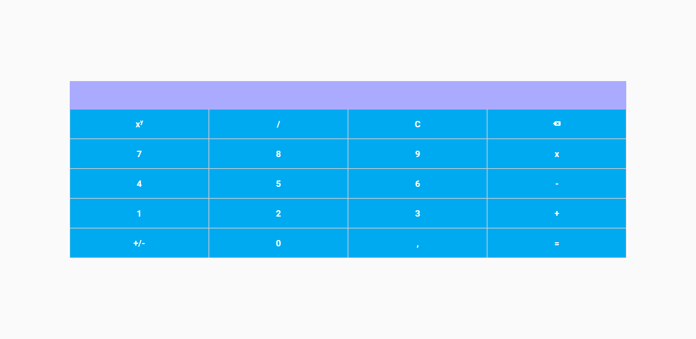

# Calculadora React


## 📌 Sumário

- [Sobre o Projeto](#-sobre-o-projeto)
- [Funcionalidades](#-funcionalidades)
- [Tecnologias](#-tecnologias)
- [Layout](#-layout)
- [Como Executar](#-como-executar)
- [Licença](#-licença)
- [Contato](#-contato)

## 🧮 Sobre o Projeto

Este projeto é uma calculadora interativa desenvolvida com React, inspirada na Formação React Developer da Digital Innovation One. Ele oferece uma interface moderna e responsiva para realizar cálculos matemáticos básicos, implementada por Matheus Breder.

## ✨ Funcionalidades

- **Operações Básicas**: Adição, subtração, multiplicação, divisão e potência
- **Números Decimais**: Suporte para cálculos com pontos flutuantes
- **Inversão de Sinal**: Botão para inverter o sinal
- **Backspace**: Botão para apagar um digito
- **Clear (C)**: Botão para limpar o visor e reiniciar os cálculos
- **Design Responsivo**: Interface adaptável a diferentes tamanhos de tela

## 🛠 Tecnologias

As seguintes ferramentas foram usadas na construção do projeto:

- [React](https://reactjs.org/)
- [Styled Components](https://styled-components.com/)
- [JavaScript](https://developer.mozilla.org/en-US/docs/Web/JavaScript)

## 🎨 Layout

O layout da calculadora apresenta um design moderno, utilizando tons de cinza e azul. A interface é composta por um display para exibição dos números e resultados, seguido por botões para dígitos e operações matemáticas.



## 🚀 Como Executar

```bash
# Clone este repositório
$ git clone https://github.com/mathbreder/calculadora-react.git

# Acesse a pasta do projeto no terminal/cmd
$ cd calculadora-react

# Instale as dependências
$ pnpm install

# Execute a aplicação em modo de desenvolvimento
$ pnpm run dev

# O servidor iniciará na porta:5173 - acesse http://localhost:5173
```

## 📝 Licença

Distribuído sob a licença MIT. Veja `LICENSE` para mais informações.

## 📫 Contato

Matheus Breder - matheus.breder@outlook.com.br

Link do Projeto: [https://github.com/mathbreder/calculadora-react](https://github.com/mathbreder/calculadora-react)

---

⌨️ com ❤️ por [Matheus Breder](https://github.com/mathbreder) 😊